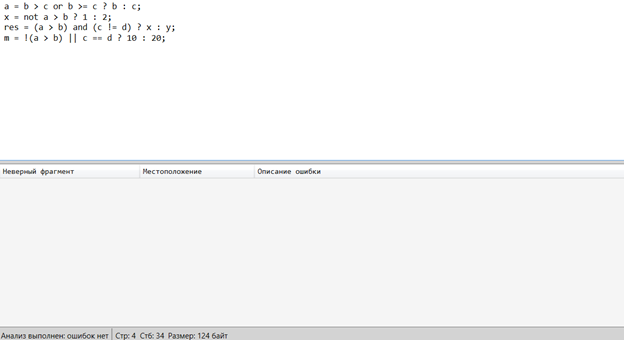
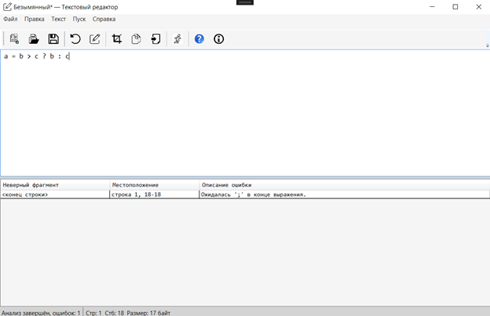
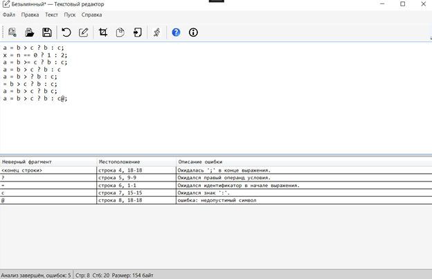

# Лабораторная работа №3. Разработка синтаксического анализатора (парсера)

## Цель работы
Изучить назначение и принципы работы синтаксического анализатора в структуре компилятора. Спроектировать грамматику, построить соответствующую схему метода анализа грамматики и выполнить программную реализацию парсера с нейтрализацией синтаксических ошибок методом Айронса. Интегрировать разработанный модуль в ранее созданный графический интерфейс языкового процессора.

## Автор
Геронимус Матвей Анатольевич  
Группа: АП-326

## Постановка задачи
Разработать синтаксический анализатор (парсер) в соответствии с индивидуальным вариантом курсовой работы, интегрировать его в приложение из лабораторной работы №1 и обеспечить наглядный вывод результатов анализа.

### Требования к разработке парсера
- Разработать грамматику для заданной синтаксической конструкции.
- Построить схему метода анализа на основе разработанной грамматики.
- Выполнить программную реализацию алгоритма работы синтаксического анализа.
- Реализовать алгоритм нейтрализации синтаксических ошибок методом Айронса.

### Входные данные
Строка или многострочный текст программного кода из области редактирования.

### Выходные данные
- При успешном анализе корректной строки — сообщение об отсутствии ошибок.
- При обнаружении ошибок — таблица с описанием каждой ошибки.

## Вариант
**Тернарный оператор языка C++**

Пример конструкции:
```cpp
a = b > c ? b : c;
```

## Допустимые лексемы

| Лексема | Код |
|---|---:|
| Числовая константа (`num`) | 1 |
| Идентификатор (`id`) | 2 |
| Разделитель-пробел (`sp`) | 3 |
| Оператор | 4 |
| Знак `?` | 5 |
| Знак `:` | 6 |
| Знак `;` | 7 |
| Открывающая скобка `(` | 8 |
| Закрывающая скобка `)` | 9 |

В данной работе числовая константа представлена целым беззнаковым числом.

### Допустимые операторы для кода 4
- оператор присваивания: `"="`
- операторы отношения: `">"`, `"<"`, `">="`, `"<="`, `"=="`, `"!="`
- логические операторы: `"and"`, `"or"`, `"not"`, `"&&"`, `"||"`, `"!"`

### Примеры корректных строк
```cpp
a = b > c or b >= c ? b : c;
x = not a > b ? 1 : 2;
res = (a > b) and (c != d) ? x : y;
m = !(a > b) || c == d ? 10 : 20;
```

Разработка грамматики

Формально грамматика записывается в виде:

G[Z] = (Vn, Vt, P, Z)

Vn = { Z, <тернарное-выражение>, <логическое-выражение>, <логическое-или>,
       <логическое-и>, <логическое-не>, <отношение>, <операнд>,
       <оператор-отношения> }

Vt = { a, ..., z, A, ..., Z, 0, ..., 9, ' ', =, ?, :, ;, >, <, !, &, |, (, ) }

P:
1) Z -> id sp "=" sp <тернарное-выражение> ";"

2) <тернарное-выражение> -> <логическое-выражение> sp "?" sp <операнд> sp ":" sp <операнд>

3) <логическое-выражение> -> <логическое-или>

4) <логическое-или> -> <логическое-и>
5) <логическое-или> -> <логическое-и> sp "or" sp <логическое-или>
6) <логическое-или> -> <логическое-и> sp "||" sp <логическое-или>

7) <логическое-и> -> <логическое-не>
8) <логическое-и> -> <логическое-не> sp "and" sp <логическое-и>
9) <логическое-и> -> <логическое-не> sp "&&" sp <логическое-и>

10) <логическое-не> -> <отношение>
11) <логическое-не> -> "not" sp <логическое-не>
12) <логическое-не> -> "!" <логическое-не>

13) <отношение> -> <операнд> sp <оператор-отношения> sp <операнд>
14) <отношение> -> "(" <логическое-выражение> ")"

15) <операнд> -> id | num

16) <оператор-отношения> -> ">" | "<" | ">=" | "<=" | "==" | "!="

### Расшифровка обозначений
```text
id -> letter {letter}
sp -> ' '
num -> digit {digit}
letter -> 'a' | ... | 'z' | 'A' | ... | 'Z'
digit -> '0' | ... | '9'
```

## Классификация грамматики (по Хомскому)
Разработанная грамматика является **контекстно-свободной**, то есть относится к **грамматикам 2 типа по классификации Хомского**.

Это объясняется тем, что каждое правило вывода имеет вид:

```text
A -> α
```

где:
- `A` — один нетерминальный символ;
- `α` — последовательность терминальных и нетерминальных символов.

Так как в левой части каждого правила стоит ровно один нетерминал, разработанная грамматика является контекстно-свободной и допускает построение синтаксического анализатора методом рекурсивного спуска.


## Метод анализа
Так как разработанная грамматика является контекстно-свободной, для синтаксического анализа используется **метод рекурсивного спуска**.

Основная идея метода рекурсивного спуска состоит в том, что каждому нетерминалу грамматики ставится в соответствие отдельная процедура синтаксического анализа. Эти процедуры вызываются в соответствии с правилами грамматики и последовательно распознают корректную цепочку лексем.

В программе реализованы следующие основные процедуры:
- `parseStatement`
- `parseTernaryExpression`
- `parseLogicalExpression`
- `parseLogicalOr`
- `parseLogicalAnd`
- `parseLogicalNot`
- `parseRelation`
- `parseOperand`
- `parseIdentifier`
- `parseIdentifierTail`
- `parseNumber`
- `parseNumberTail`
- `parseRelationOperator`
- `parseSpaces`
- `reportTrailingTokens`

Главной процедурой является `parseStatement`, которая соответствует начальному символу `Z` и анализирует конструкцию вида:

```cpp
идентификатор = логическое_выражение ? операнд : операнд;
```

### Диаграмма рекурсивного спуска


## Диагностика и нейтрализация синтаксических ошибок
Для диагностики и нейтрализации синтаксических ошибок в программе реализован механизм восстановления разбора, основанный на идее метода Айронса.

Основная идея состоит в том, что при возникновении синтаксической ошибки анализатор не прекращает работу полностью, а:
- фиксирует ошибочный фрагмент;
- выполняет восстановление по ближайшим точкам синхронизации;
- продолжает разбор оставшегося текста.

В данной работе это реализовано следующим образом:
- сначала каждая строка передаётся в лексический анализатор;
- если в строке обнаружены лексические ошибки, они заносятся в итоговую таблицу, а синтаксический анализ данной строки не выполняется;
- если лексических ошибок нет, поток лексем передаётся в синтаксический анализатор;
- при возникновении синтаксической ошибки анализатор переходит к ближайшей допустимой точке продолжения разбора и затем продолжает анализ.

В качестве точек синхронизации используются ключевые элементы конструкции:
- `"?"`
- `":"`
- `";"`

Такой подход позволяет:
- не останавливаться после первой ошибки;
- находить несколько ошибок за один запуск;
- сохранять устойчивость анализа даже при многострочном вводе.

## Интерфейс программы
Программа реализована в виде текстового редактора с графическим интерфейсом на WPF.

Функциональность интерфейса:
- ввод текста в область редактирования;
- запуск анализа по кнопке **Пуск**;
- сначала выполнение лексического анализа, затем синтаксического;
- вывод найденных ошибок в таблицу;
- отображение общего количества ошибок в строке статуса;
- переход к месту ошибки по щелчку на строке таблицы;
- подсветка ошибочного фрагмента в редакторе.

## Тестовые примеры

### Пример корректного ввода строки


### Пример некорректного ввода строки


### Пример многострочного ввода


## Вывод
В ходе выполнения лабораторной работы был разработан синтаксический анализатор для тернарного оператора языка C++. Была спроектирована формальная грамматика, построена схема метода анализа и реализован парсер методом рекурсивного спуска.

Также был реализован механизм диагностики и нейтрализации синтаксических ошибок, основанный на идее метода Айронса, что позволило находить несколько ошибок за один запуск и продолжать анализ после возникновения ошибки.

Разработанный синтаксический анализатор был успешно интегрирован в графический интерфейс приложения, созданного ранее, и обеспечивает удобное отображение результатов анализа и навигацию по найденным ошибкам.
