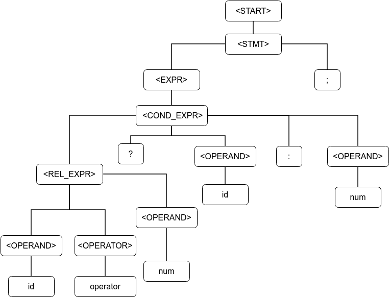
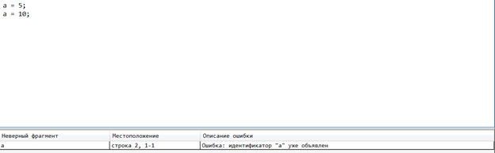
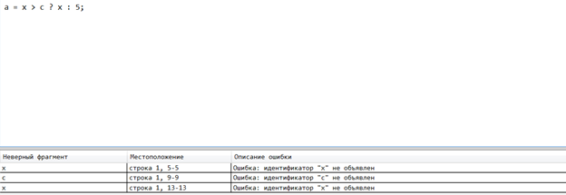
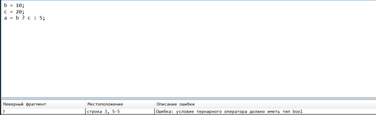
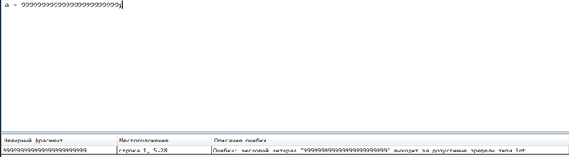
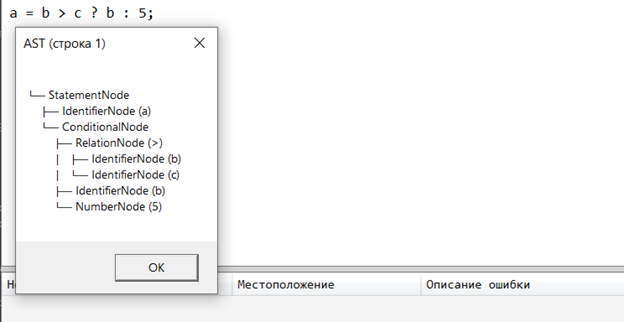

# Лабораторная работа №5

**Автор:** Геронимус Матвей Анатольевич  
**Проект:** WPF текстовый редактор с лексическим, синтаксическим и семантическим анализом тернарного оператора

---

## Вариант задания

Обрабатываемая конструкция:

```cpp
a = b > c ? b : 5;
```

---

## Примеры корректных строк

```cpp
a = 5;
b = 10;
c = 20;
a = b > c ? b : 5;
```
## CST / AST (схема для корректной строки)

Ниже приведена схема дерева разбора для корректной строки тернарного оператора.



---

## Реализованные контекстно-зависимые условия

### 1. Уникальность идентификаторов

```cpp
a = 5;
a = 10;
```

Ошибка:
```
Ошибка: идентификатор "a" уже объявлен
```

  


---

### 2. Использование идентификаторов

```cpp
a = x > c ? x : 5;
```

Ошибка:
```
Ошибка: идентификатор "x" не объявлен
```

  


---

### 3. Совместимость типов

```cpp
b = 10;
c = 20;
a = b ? c : 5;
```

Ошибка:
```
Ошибка: условие тернарного оператора должно иметь тип bool
```

  


---

### 4. Допустимые значения

```cpp
a = 999999999999999999999;
```

Ошибка:
```
Ошибка: числовой литерал выходит за допустимые пределы типа int
```

  


---

## Структура AST

Типы узлов:
- AstNode
- StatementNode
- ExpressionNode
- IdentifierNode
- NumberNode
- RelationNode
- ConditionalNode

---

## Пример AST

```text
StatementNode
├── IdentifierNode (a)
└── ConditionalNode
    ├── RelationNode (>)
    │   ├── IdentifierNode (b)
    │   └── IdentifierNode (c)
    ├── IdentifierNode (b)
    └── NumberNode (5)
```

  


---

## Формат вывода

После нажатия кнопки **Пуск**:
- выполняется анализ
- отображается AST
- выводятся ошибки с позициями

---

## Используемые технологии

- C#
- WPF
- .NET

---
